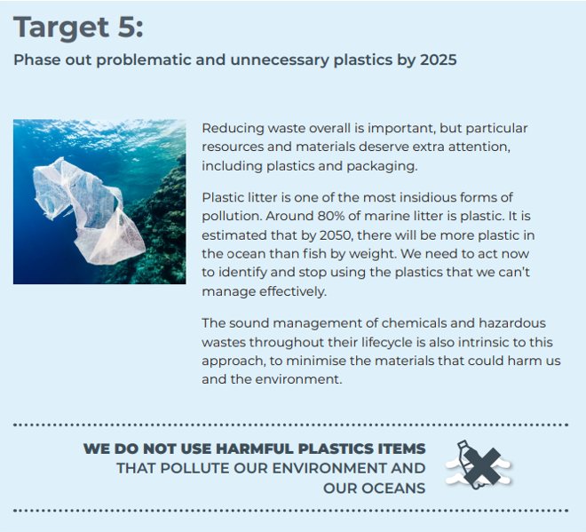

# WaterWaste

__Objective: Train accurate detector for detecting waste in ocean/waterways to aid in the identification and reduction of polution and waste contaimination.__

__Problem Statement:__ `CSIRO (Commonwealth Scientific and Industrial Research Organization)`, Australia's national science agency, has provided the first ever global estimate for microplastics on the seafloor, with results suggesting there are 14 million tonnes in the deep ocean. Refer here for the recent (Oct 2020) published study on the amount of plastic pollution in our ocean and the corresponding impact: _[Microplastic Pollution in Deep-Sea Sediments From the Great Australian Bight](https://www.frontiersin.org/articles/10.3389/fmars.2020.576170/full)_

To be apart of the solution, we seek to assist the reduction of plastic ending up in the oceans by creating a synthetic dataset that is reasonably generalizable in the real world environment to detect plastic and other objects to support and inform recycling and waste industries to remove floating rubbish for removal and behavior change. 

>Solutions are needed now:
>- The World Economic Forum estimates one garbage truck of plastic alone is dumped into the ocean every minute of every day.
>- It estimates there could be more plastic in the ocean than fish by 2050.


<table>
  <tr>
    <td></td>
    <td></td>
  </tr>
</table> 

### Summary

1. Generate synthetic dataset of important objects using Maya
2. Train detector using Faster RCNN networks on generated synthetics dataset
3. Fine tune detector with real world data

The use of generating syntehtics data enables an agile and iterative approach to rapidly improve the training dataset and model performance by automating the manual and time-consuming data collection and annotation activities. After reviewing the performance of the detector after each training iteration, we are able to rapidly generate additional datasets, 'waste' objects and add additional environmental parameters (e.g., reflections, debris, object occlusion) in minutes with a new large dataset.


## Installation 

The Andaconda python package manager is utilized for managing our python libraries. Note, on first install make sure to confirm conda to the `.bashrc` for the python interpret to activate in the shell.

The dependencies have been tested on Ubuntu 18.04 on Python 3.6+ refer to the `environment.yml` file for details. The install the dependencies run the following:

```
conda env create -f environment.yml --name ww
conda activate ww
```


### Inital Setup

1. Clone this repository ([git installation required](https://git-scm.com/))
   ```
   cd $HOME # or another directory for this project/repo
   git clone https://github.com/ProjectZeroWaste/WaterWaste.git
   cd WaterWaste
   ```
2. Install environment with [Anaconda](https://www.continuum.io/downloads): 
   
   ```
   conda env create -f environment.yml
   conda activate ww
   
   ## if using Jupyter Notebooks create custom jupyter kernel for WaterWaste
   python -m ipykernel install --user --name=ww
   ```
    In the `environment.yml` file, change Tensorflow installation from `tensorflow-gpu` to `tensorflow` if planning to run only on CPU (e.g., GPU is not available).
    _Refer here for additional steps on [setting up anaconda python environment](https://conda.io/docs/using/envs.html#managing-environments)_

3. Install tensorflow object detection API + visualizaiton tools

  ```
  # Clone the tensorflow models repository
  cd $HOME
  git clone --depth 1 https://github.com/tensorflow/models

  sudo apt install -y protobuf-compiler
  cd models/research/
  protoc object_detection/protos/*.proto --python_out=.
  python -m pip install .
  ```

## National Waste Policy Action Plan - 2019 



_source: [National Waste Policy Action Plan by AU Gov](https://www.environment.gov.au/protection/waste-resource-recovery/publications/national-waste-policy-action-plan)_

